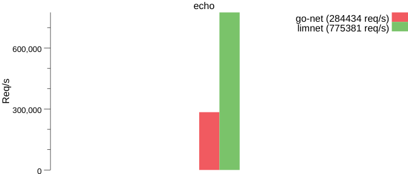

## limnet

limnet 轻量，快速，高效的网络框架。

```
s := limnet.New(handler,address,opts...) // 创建limnet服务
s.Run()  // 开始
```

## 安装

go get -u github.com/tangtaoit/limnet

## 快速入门

#### echo demo

```
package main

import (
	"flag"
	"fmt"

	"github.com/tangtaoit/limnet"
)

type echoServer struct {
	limnet.DefaultEventHandler
}

func (e *echoServer) OnPacket(c *limnet.Conn, data []byte) {
	c.Write(data)
}

func main() {
	var port int
	flag.IntVar(&port, "port", 9000, "--port 9000")
	flag.Parse()
    handler := &echoServer{}
	lm := limnet.New(handler, limnet.WithAddr(fmt.Sprintf("127.0.0.1:%d", port)))
	lm.Run()
}
```

handler是一个接口，接口结构如下

```

// EventHandler 事件处理者接口
type EventHandler interface {
	// 建立连接
	OnConnect(c *Conn)
	// 收到包 [data]为完整的数据包的数据
	OnPacket(c *Conn, data []byte)
	// 连接关闭
	OnClose(c *Conn)
}

```

## 性能测试

运行 benchmarks/bench.sh

#### Echo Server 在mac上测试结果

go-net为原生的网络库，limnet为本库

